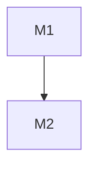

# Development Plan and Execution Prompts

Convert source documents into a plan that remains valid as milestones merge:

- `.docs/DEVELOPMENT_PLAN.md` — the committed, authoritative milestone plan.
- `.docs/EXECUTION_PROMPTS.md` — the committed, authoritative `/goal` contract for each milestone.
- `.docs/DEVELOPMENT_PLAN_HISTORY.md` — the single local, append-only design-evidence ledger. It must be gitignored.

This skill plans from documents only. Do not implement product code, create branches, open PRs, or execute the generated prompts.

## Scope Boundary

| Situation | Package |
|---|---|
| Destination or the decisions needed to define it remain uncertain | `decision-map` |


## Inputs

Accept either input shape:

| Input shape | Meaning |
| --- | --- |
| Folder path | Recursively ingest every supported document in that folder. |
| Explicit file list | Ingest listed files only; treat the first file as the primary source of truth. |

Optional context:

| Field | Meaning | Default |
| --- | --- | --- |
| `REPO_CONTEXT` | Target repo path or description; inspect its current structure, tooling, CI, style, release conventions, and partial implementation. | Greenfield planning if absent. |
| `GLOBAL_CONSTRAINTS` | Cross-cutting constraints absent from source docs. | None. |
| `STACK_DEPTH_HINT` | Maximum PRs per milestone stack. | 6. |

## Workflow

### Phase 0 — Ingest and ground the plan

1. Inventory every capability, contract, data model, integration, workflow, and non-functional requirement in the source docs.
2. Preserve source order, but resolve authority by input shape: explicit file-list order wins; otherwise newer or more-specific design docs refine broader overview docs.
3. Build a traceability table from source references to planned capabilities. Use document paths plus section names or line ranges when available.
4. Record `> ASSUMPTION:` for defensible defaults. Record `> GAP:` for missing, ambiguous, or contradictory requirements. A contradiction affecting architecture, data semantics, security posture, or acceptance blocks output until resolved.
5. Map implementation-relevant dependencies. Inspect the target repo when available: CI, package manager, test/type/lint commands, naming conventions, partial implementations, version source, `CHANGELOG.md`, tags, branches, and release commands.
6. Identify source-traceable release targets and group milestones into shared release trains. Every milestone must target a named release, `unversioned`, `none`, or visible `> GAP:`. Never infer a version.
7. For a greenfield repo, make M1 establish the minimum verification surface required by later milestones.
8. If existing plan/prompt artifacts are present, read them before regenerating. Treat them as the current committed contract, not as immutable truth.

Summarize the inventory, dependencies, release trains, assumptions, gaps, and verification surface in chat only.

### Phase 1 — Write plan and local history

Create `.docs` when absent. Create `.docs/DEVELOPMENT_PLAN_HISTORY.md` with a header stating that it is local evidence only; `DEVELOPMENT_PLAN.md` and `EXECUTION_PROMPTS.md` are authoritative. Verify the exact history path is ignored with `git check-ignore`. When it is not ignored, add only `.docs/DEVELOPMENT_PLAN_HISTORY.md` to `.gitignore`; create `.gitignore` with that one rule only when it does not exist.

Write `.docs/DEVELOPMENT_PLAN.md` with this structure:

```markdown
# Development Plan — <System>

## 1. Context & Source Map
<2–4 sentences and a table mapping plan sections and milestone groups to source documents/sections.>

## 2. Assumptions & Gaps
<Visible `> ASSUMPTION:` and `> GAP:` entries, or "None.">

## 3. Dependency Graph


## 4. Release Trains
| Target release | Included milestones | Preparation trigger | Required artifacts | Verification | Publication |
| --- | --- | --- | --- | --- | --- |
| `<version | unversioned | none>` | `<M1, M2>` | All included milestones are externally merged. | `<version update | CHANGELOG.md | both | none>` | `<exact command or binary manual check>` | `<required command/workflow | not requested>` |

## 5. Plan Evolution Protocol
- The committed plan and prompt files are authoritative. The ignored history ledger is reconstructible local evidence.
- Before each milestone, inspect its current plan/prompt, source map, current codebase, merged predecessor diffs, predecessor verification/CI evidence, and the local history when available.
- Record exactly one `DESIGN GO — PLAN REVISION: none`, `DESIGN GO — PLAN REVISION: <entry IDs>`, or `DESIGN NO-GO — REASON: <blocking evidence>`.
- A material mismatch updates the current milestone and every directly or transitively affected future milestone in both authoritative files. Recompute the dependency graph, critical path, and release-train membership when affected.
- `DESIGN NO-GO` blocks code, branches, and implementation PRs. A material plan revision requires a docs-only reconciliation PR that is reviewed, green, and externally merged before implementation.

## 6. Sections & Milestones
### Section A — <name>
#### M1 — <title>
| Field | Value |
| --- | --- |
| Objective | Observable outcome, 1–2 sentences. |
| In / Out of scope | Explicit boundaries. |
| Depends on | `none` or milestone IDs. |
| Target release | Named release train, `unversioned`, `none`, or `> GAP:`. |
| Deliverables | Concrete artifacts or behavior. |
| Acceptance | Binary, testable statements. |
| Verification | Exact command(s) and expected result. |
| Design reevaluation | Evidence to inspect before implementation; list direct/transitive dependent milestone IDs that require review if this design changes. |
| Risks & rollback | Failure modes; stack is the rollback unit unless a finer rollback is source-traceable. |
| Est. PRs | Integer ≤ `STACK_DEPTH_HINT`; exclude a conditional docs-only reconciliation root PR. |

## 7. Cross-Cutting Concerns
<Security, privacy, perf, observability, migrations, back-compat, release management — only when source-traceable.>

## 8. Critical Path
<Ordered table or Mermaid diagram through the DAG and release-train completion.>
```

Planning rules:

- Decompose by capability or layer, not by file. Keep milestones standalone and self-verifiable.
- Every acceptance row needs a command, asserted output, CI signal, or clearly flagged minimum manual check.
- Assign release preparation once per shared release train, after every included milestone merges.
- Derive version/changelog requirements from source and repo evidence. Use `> GAP:` rather than inventing release policy.
- Use Mermaid and Markdown tables only. Validate Mermaid when tooling is available.

### Phase 2 — Write execution prompts

Create one `/goal` block per milestone. It must trace to that milestone’s objective, deliverables, acceptance, verification, design-reevaluation row, and release train. Do not invent scope.

```markdown
# Execution Prompts — <System>

## Global execution rules (apply to every goal)
- Use `stacked-prs`; each implementation PR is based on the preceding stack branch until that base merges.
- Use Conventional Commits, atomic commits, no attribution, and independently reviewable PRs.
- Run the mandatory pre-implementation design gate before creating product-code branches or changing product code.
- The committed plan/prompt files are authoritative. The local ignored history ledger is evidence; rebuild it from committed artifacts, merged PRs, CI, and current code when absent.
- A material plan change must update the current milestone and every affected future milestone before implementation. Rebuild the DAG and release trains after the update.
- A docs-only reconciliation PR is required for a material revision. It must be reviewed, green, and externally merged before code begins.
- A shared mismatch in a proposed parallel wave blocks product-code work in every affected lane. Do not continue scaffolding, partial implementation, or isolated ledger writes while reconciliation is pending.
- `GO` only makes the milestone stack merge-eligible. Release preparation remains deferred until every milestone in its train is externally merged.

### M1 — <title>
```text
/goal Deliver milestone M1 (<title>) from DEVELOPMENT_PLAN.md as a reviewed stack of PRs.

CONTEXT: DEVELOPMENT_PLAN.md §6 M1 + source docs. Preconditions: <none | Mx merged>. Repo: <language, package manager, test runner, type/lint/CI surface>.
OBJECTIVE: <objective and acceptance criteria as the success contract>.
RELEASE TRAIN: target=<named version | unversioned | none | > GAP: unresolved>; included milestones=<Mx>; preparation trigger=<all included milestones externally merged>; required artifacts=<version update | CHANGELOG.md | both | none>; release verification=<exact command or binary manual check>; publication=<required command/workflow | not requested>.

PRE-IMPLEMENTATION DESIGN GATE:
1. Read this milestone, its source-map rows, current prompt, and `.docs/DEVELOPMENT_PLAN_HISTORY.md` when present.
2. Inspect the current codebase plus merged predecessor diffs, merged predecessor PR outcomes, CI/check evidence, and predecessor verification output.
3. Revalidate objective, interfaces, dependencies, acceptance, verification, risks, release train, and every listed dependent milestone.
4. Append one ledger entry: timestamp, milestone, decision, trigger, evidence, plan/prompt sections changed, downstream impact, and implementation authorization.
5. If no material mismatch exists, report `DESIGN GO — PLAN REVISION: none`; this authorizes implementation.
6. If a mismatch exists, update both authoritative artifacts for M1 and every affected future milestone, append the revision ID, and report `DESIGN GO — PLAN REVISION: <entry IDs>`. This records a completed diagnosis but blocks product-code work until the reconciliation prerequisite merges.
7. If validity cannot be established, report `DESIGN NO-GO — REASON: <evidence>` and stop. After a reconciliation PR merges, repeat this gate and require `DESIGN GO — PLAN REVISION: none` before implementation.

RECONCILIATION RULE: A material revision opens `docs(plan): reconcile M1 design` as a docs-only prerequisite PR. It contains no product code, must be reviewed, green, and externally merged before any code PR, and must not be folded into an implementation PR.

PLANNED STACK (refine only to keep PRs reviewable):
0. Conditional prerequisite `docs(plan): reconcile M1 design` — scope: authoritative plan/prompt updates only; gate: reviewed, green, and merged before the implementation stack.
1. PR-1 <purpose> — scope: <areas>; commits: <c1>, <c2>; verification: <PR-specific command if narrower than milestone command>
2. PR-2 <purpose, on PR-1> — scope: <areas>; commits: <c1>, <c2>

CONSTRAINTS: no scope leakage, minimal dependencies, repo style, no version/changelog updates before the release-train trigger unless source-traceable.
VERIFICATION (must pass): <exact command(s) and expected result>.
REVIEW:
Per PR:
- Scope matches its purpose; contracts match the reconciled plan; behavior is meaningfully tested.
- Failures are loud; security, data safety, and rollback requirements are addressed where relevant.
- History is atomic, conventional, attribution-free, and free of unrelated formatting churn.
- PR-specific verification output is captured.
Whole stack:
- Bases form one valid stack; cumulative acceptance and integration hold; CI is green; no regression coverage is removed without replacement.
- The docs-only root, when present, is reviewed and green before dependent code PRs.
- Report PR URLs, bases, verification, risks, manual gates, and review completion.
FINAL VERDICTS:
- Report the design verdict before the merge verdict.
- Then report exactly one merge verdict: `GO — RELEASE: <target> — RELEASE PREP: <pending | not-required>` or `NO-GO — RELEASE: <target> — REASON: <blocking gate>`.
- `GO` requires `DESIGN GO`, every PR correctly based/reviewed/green, local verification, and full milestone acceptance. `NO-GO` applies to pending or failed checks, incomplete review, scope drift, ambiguous readiness, manual gates, or unresolved release target.
NEXT STEPS: (required after either merge verdict; concrete, ordered, and evidence-backed)
1. Current milestone: `<merge the reviewed stack | already merged | stop on NO-GO>`.
2. Release: `<deferred until listed train members merge | begin declared preparation | not-required | blocked with reason>`.
3. Next milestone: `<M# and dependency/release-train evidence | SKIP <current> FOR NOW; RUN M# — independent of <closure> | none — reason>`.
4. For `NO-GO`: `<specific remediation and exact retry gate>`; otherwise `not applicable`.
- On `GO`, steps 1–3 are mandatory. On `NO-GO`, steps 1–4 are mandatory; never advance a dependent milestone.
- Render the literal heading `NEXT STEPS:`. A prose follow-up or JSON `next_steps` key is insufficient.
- Never infer a milestone, remediation, version/changelog artifact, tag, or publication action.
DONE: design verdict with evidence; when authorized, a reviewed stack with a release-aware merge verdict and the required next-steps list.
```
```

Add this to destructive milestones:

```text
HUMAN REVIEW GATE: Do not merge or run destructive paths unattended until a human reviews dry-run output, rollback notes, and audit/tombstone logging.
```

## Quality gates

Before yielding, check and fix:

- Every capability maps to a milestone; the DAG is acyclic; every milestone has binary acceptance and command-backed verification.
- Every milestone has an explicit release target and design-reevaluation row.
- Every prompt includes the design gate, dependency-impact propagation, local-history treatment, docs-only reconciliation rule, per-PR/whole-stack review, both verdict formats, and a concrete `NEXT STEPS` contract.
- Release preparation is assigned once per train and only after every train milestone merges.
- `.docs/DEVELOPMENT_PLAN_HISTORY.md` exists, is the only history ledger, and is ignored by an exact or broader verified rule.
- Only the two authoritative artifacts, the one local history ledger, and the minimum `.gitignore` update required to ignore it are written.

## Error handling

| Problem | Resolution |
| --- | --- |
| Folder contains no readable docs or an explicit path is missing | Stop; report the missing input. |
| Source docs contradict on architecture, data semantics, security, or acceptance | Emit blocking `> GAP:`; do not invent a resolution. |
| Repo tooling is absent | Treat as greenfield and make M1 establish verification. |
| Release policy is absent | Emit visible `> GAP:`; do not invent version, changelog, tag, or publication work. |
| Existing authoritative artifacts exist | Read them first; overwrite only on requested regeneration; preserve no stale milestones. |
| History path is not ignored | Add only the exact ignore rule, verify it, then write the ledger. |
| History ledger is missing later | Reconstruct evidence from committed artifacts, merged PRs, CI, and current code; do not treat its absence as plan loss. |

## Output and chat response

Report the Phase 0 summary, paths written, ignored-history verification, quality-gate result, destructive human gates, and unresolved release targets. Do not paste generated files unless requested.
