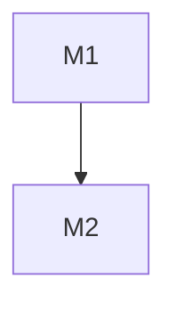

# Development Plan and Execution Prompts

Convert source documents into two standalone Markdown files:

- `.docs/DEVELOPMENT_PLAN.md` — milestone plan with source traceability, dependencies, acceptance, verification, risks, and rollback notes.
- `.docs/EXECUTION_PROMPTS.md` — one copy-paste `/goal` block per milestone that drives a reviewed stacked-PR implementation.

This skill plans from documents only. Do not implement product code, create branches, open PRs, or execute the generated prompts.

## Inputs

Accept either input shape:

| Input shape | Meaning |
| --- | --- |
| Folder path | Recursively ingest every supported document in that folder. |
| Explicit file list | Ingest listed files only; treat the first file as the primary source of truth. |

Optional context:

| Field | Meaning | Default |
| --- | --- | --- |
| `REPO_CONTEXT` | Target repo path or description; use actual repo structure, tooling, CI, style, and release conventions when a path exists. | Greenfield planning if absent. |
| `GLOBAL_CONSTRAINTS` | Cross-cutting constraints not present in source docs: compliance, dependency policy, deadlines, perf budgets, release policy. | None. |
| `STACK_DEPTH_HINT` | Maximum PRs per milestone stack. | 6. |

## Workflow

### Phase 0 — Ingest and ground the plan

1. Inventory every capability, contract, data model, integration, workflow, and non-functional requirement in the source docs.
2. Preserve source order, but resolve authority by input shape: explicit file list order wins; otherwise newer or more specific design docs refine broader overview docs.
3. Build a traceability table from source references to planned capabilities. Use document paths plus section names or line ranges when available.
4. Record `> ASSUMPTION:` for defensible defaults where docs are silent.
5. Record `> GAP:` for missing, ambiguous, or contradictory requirements. Contradictions that change architecture, data semantics, security posture, or acceptance block file creation until resolved.
6. Map dependencies between capabilities. Dependencies must be implementation-relevant, not topical adjacency.
7. Inspect the target repo when available: CI workflows, package manager, test runner, type checker, linter, existing test naming, existing partial implementations, repository conventions, version source, `CHANGELOG.md`, tags, release branches, and documented release commands. Copy exact verification and release commands from the repo's own config or CI when possible.
8. Identify source-traceable release targets and group milestones into shared release trains. Every milestone must explicitly target a named release, an unversioned release train, `none`, or a visible `> GAP:`. Never infer a semantic version from feature scope.
9. If the repo is greenfield, make M1 establish the minimal skeleton and verification surface needed for later milestones to be testable.

Summarize Phase 0 in the chat response only. Do not duplicate the full ingest inventory inside the generated files.

### Phase 1 — Write `.docs/DEVELOPMENT_PLAN.md`

Create `.docs` if it does not exist. Write a standalone plan with this structure:

```markdown
# Development Plan — <System>

## 1. Context & Source Map
<2–4 sentences, then a table mapping plan sections and milestone groups to source documents/sections.>

## 2. Assumptions & Gaps
<Visible `> ASSUMPTION:` and `> GAP:` entries, or "None.">

## 3. Dependency Graph


## 4. Release Trains
| Target release | Included milestones | Preparation trigger | Required artifacts | Verification | Publication |
| --- | --- | --- | --- | --- | --- |
| `<version | unversioned | none>` | `<M1, M2>` | All included milestones are externally merged. | `<version update | CHANGELOG.md | both | none>` | `<exact command or binary manual check>` | `<required command/workflow | not requested>` |

## 5. Sections & Milestones
### Section A — <name>
#### M1 — <title>
| Field | Value |
| --- | --- |
| Objective | Observable outcome, 1–2 sentences. |
| In / Out of scope | Explicit boundaries. |
| Depends on | `none` or milestone IDs. |
| Target release | Named release train, `unversioned`, `none`, or `> GAP:`. |
| Deliverables | Concrete artifacts or behavior. |
| Acceptance | Binary, testable statements. |
| Verification | Exact command(s) and expected result. |
| Risks & rollback | Failure modes; stack is the rollback unit unless a finer rollback is doc-traceable. |
| Est. PRs | Integer ≤ `STACK_DEPTH_HINT`. |

## 6. Cross-Cutting Concerns
<Security, privacy, perf, observability, migrations, back-compat, release management — only when source-traceable.>

## 7. Critical Path
<Ordered table or Mermaid diagram through the DAG and release-train completion.>
```

Planning rules:

- Decompose by capability or layer, not by file.
- Each milestone must be standalone and self-verifiable.
- Split any milestone estimated above `STACK_DEPTH_HINT` PRs.
- Order foundations before consumers.
- Keep shared context in the preamble; do not repeat it in every milestone.
- Every acceptance row must be checkable by a command, asserted script output, CI signal, or clearly flagged minimal manual check.
- Assign release preparation once per shared release train, after all included milestones merge. Do not create a version bump or changelog entry per feature milestone.
- Derive version and changelog requirements from source documents and repository conventions. Use `none` only when evidence shows that no release artifact is required; use `> GAP:` rather than inventing a release target or versioning policy.
- Use Mermaid and Markdown tables only for visuals.
- Validate the Mermaid DAG before final output when Mermaid validation tooling is available.

### Phase 2 — Write `.docs/EXECUTION_PROMPTS.md`

Create one `/goal` block per milestone. The prompt must trace directly to the matching milestone's objective, deliverables, acceptance, and verification rows. Do not invent scope that is not in the plan.

Use this file structure:

```markdown
# Execution Prompts — <System>

## Global execution rules (apply to every goal)
- Use the `stacked-prs` skill: each PR is based on the previous PR's branch until that base merges.
- Conventional Commits, atomic commits, multiple commits per PR grouped into a reviewable narrative.
- No attribution of any kind: no `Co-authored-by`, no AI/tool mentions, no generated-by text, no emoji.
- Each PR is one coherent, independently reviewable unit.
- Review each PR individually, then review the full stack for cumulative coherence.
- A `GO` makes only the milestone stack eligible for merge. Release preparation is deferred until every milestone in its shared release train is externally merged; the runner owns that release workflow.
- Done = all PRs open and correctly based, checks green, individual and stack review complete, zero attribution, and a final release-aware `GO`/`NO-GO` merge verdict with evidence. `GO` authorizes an autonomous runner to merge after it independently verifies the gates; `NO-GO` blocks merge and downstream milestones.

### M1 — <title>
```text
/goal Deliver milestone M1 (<title>) from DEVELOPMENT_PLAN.md as a reviewed stack of PRs.

CONTEXT: DEVELOPMENT_PLAN.md §5 M1 + source docs. Preconditions: <none | Mx merged>. Repo: <language, package manager, test runner, type/lint/CI surface>.
OBJECTIVE: <objective and acceptance criteria as the success contract>.
RELEASE TRAIN: target=<named version | unversioned | none | > GAP: unresolved>; included milestones=<Mx>; preparation trigger=<all included milestones externally merged>; required artifacts=<version update | CHANGELOG.md | both | none>; release verification=<exact command or binary manual check>; publication=<required command/workflow | not requested>.

PLANNED STACK (stacked-prs skill; refine only to keep PRs reviewable):
1. PR-1 <purpose> — scope: <areas>; commits: <c1>, <c2>; verification: <PR-specific command if narrower than milestone command>
2. PR-2 <purpose, on PR-1> — scope: <areas>; commits: <c1>, <c2>

CONSTRAINTS: Conventional Commits, atomic commits, multi-commit PRs, no attribution, no scope leakage across PRs, minimal dependencies, respect repo style. Do not update version or changelog artifacts before the release-train trigger unless the milestone itself is the source-traceable release-preparation unit.
VERIFICATION (must pass): <exact command(s) + expected result from M1>.
REVIEW:
Per PR:
- Scope boundary: diff matches PR purpose; no milestone leakage; no grab-bag changes.
- Contract integrity: public APIs, schemas, CLI flags, config keys, and data shapes match the plan.
- Tests: changed behavior has meaningful unit/integration coverage; assertions test behavior and invariants, not implementation trivia.
- Error handling: failures are loud, typed/classified where useful, and not hidden behind broad fallbacks.
- Security/privacy: input validation, secret handling, auth/authz, and data exposure risks are addressed where relevant.
- Data safety: migrations or destructive operations are dry-run or opt-in where applicable, reversible where possible, and covered by rollback notes.
- Maintainability: follows repo conventions; no speculative abstractions; no duplicate source of truth.
- History: Conventional Commits, atomic commits, no attribution, no unrelated formatting churn.
- Local verification: PR-specific commands pass and output is captured.
Whole stack:
- Topology: every PR is based on the previous PR branch; no orphan or duplicate commits.
- Cumulative acceptance: the leaf stack satisfies every Mx acceptance row.
- Integration: interfaces added lower in the stack are consumed consistently higher in the stack.
- Regression surface: existing behavior remains covered; no test deletions without replacement.
- CI/checks: checks green on every PR or pending provider checks are explicitly reported.
- Rebase-clean: stack can be rebased from root to leaf without unresolved conflicts.
- Human handoff: PR URLs, verification output, risks, and manual gates are reported.
FINAL VERDICT:
- Report exactly one verdict: `GO — RELEASE: <target> — RELEASE PREP: <pending | not-required>` or `NO-GO — RELEASE: <target> — REASON: <blocking gate>`.
- `GO` only when every PR is open, correctly based, reviewed, green, locally verified, and the whole stack satisfies every milestone acceptance row. Use `pending` whenever release preparation has not started; only use `not-required` when the release train requires no release artifacts.
- `NO-GO` when any check is failing or pending, review is incomplete, branch topology is wrong, verification is missing, scope leaked, a human/manual gate remains, merge readiness is ambiguous, or the target release is unresolved.
- Evidence: list target release, included and remaining train milestones, PR URLs, branch bases, CI/check status per PR, verification command output, review completion, residual risks, and any manual gate.
DONE: stack open and correctly based, checks green, per-PR and whole-stack reviews complete, final release-aware `GO`/`NO-GO` verdict reported with evidence.
```
```

For any milestone involving deletion, destructive migrations, irreversible rewrites, user-data mutation, or source pruning, add this inside that milestone prompt:

```text
HUMAN REVIEW GATE: Do not merge or run destructive paths unattended until a human reviews dry-run output, rollback notes, and audit/tombstone logging.
```

## Quality gates

Before yielding, check and fix:

- Every inventoried capability maps to at least one milestone.
- The dependency graph is acyclic.
- Every milestone has binary acceptance and command-backed verification.
- Every milestone has an explicit named target, `unversioned`, `none`, or a visible `> GAP:`.
- Each shared release train lists included milestones, trigger, required artifacts, and verification; version or changelog work is assigned only once per train.
- No milestone exceeds `STACK_DEPTH_HINT` PRs.
- Every `/goal` block traces to one milestone's deliverables, verification, and release train.
- Every `/goal` block contains no-attribution rules, per-PR review, whole-stack review, and final release-aware `GO`/`NO-GO` verdict requirements.
- Assumptions and gaps are visible, not buried in prose.
- Mermaid diagrams parse when Mermaid validation tooling is available.
- The only files written are `.docs/DEVELOPMENT_PLAN.md` and `.docs/EXECUTION_PROMPTS.md` unless the user explicitly requests otherwise.

## Error handling

| Problem | Resolution |
| --- | --- |
| Folder contains no readable docs | Stop and report the empty input set. Do not invent a plan. |
| Explicit file path is missing | Stop and report the missing path. Do not silently skip it. |
| Source docs contradict each other | Emit blocking `> GAP:` items in chat; proceed only if a defensible default does not change architecture, data semantics, security posture, or acceptance. |
| Repo tooling is absent | Treat as greenfield and make M1 establish verification. |
| Verification cannot be fully automated | Use the smallest manual binary check, flag it in the milestone, and explain why automation is unavailable. |
| Release target or policy is absent | Emit a visible `> GAP:`. Do not invent a semantic version, version bump, changelog entry, tag, or publication step. |
| Existing `.docs/DEVELOPMENT_PLAN.md` or `.docs/EXECUTION_PROMPTS.md` exists | Read it first, then overwrite only when the user requested regeneration. Preserve no stale milestones. |

## Output Format and Chat Response

1. Phase 0 ingest summary: capabilities, dependencies, release trains, assumptions, gaps, verification surface, and release conventions.
2. Paths written.
3. Quality-gate result.
4. Any destructive milestones requiring human review.
5. Release trains blocked by unresolved targets or manual release gates.

Do not paste the full generated files into chat unless requested.
